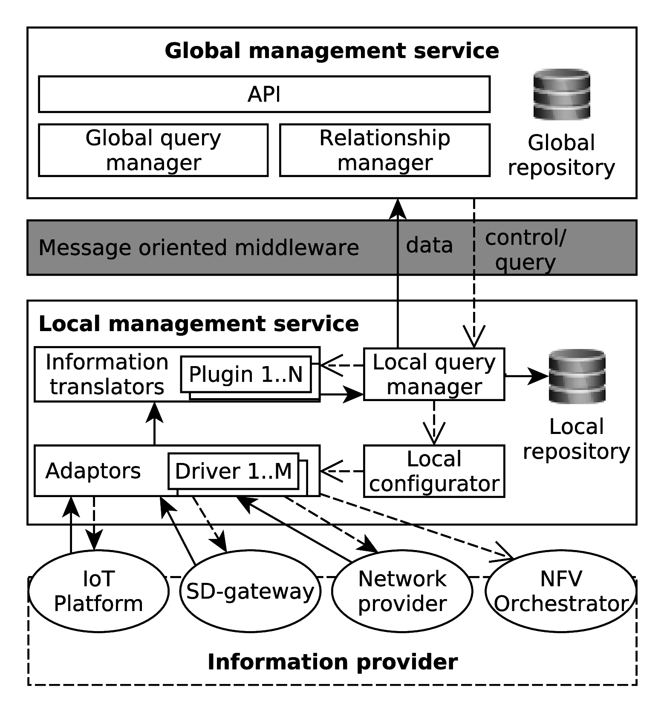

rsiHub architecture is fully distributed, which mean each components can run individually. At runtime, two types of components can be run:

 - Local Management Services: To interface with providers to tranform the information and send the control.
 - Global Management Services: To manage Local Management Services and route query to the providers.
 
{:width="400px"}

The providers that rsiHub aims to manage include following components:

 - Cloud provider: can be private cloud like Openstack, or public service like AmazonEC2.
 - Network provider: cooporate with NFV provider such as OpenDaylight, OpenBaton.
 - IoT provider: manage edge services/platform such as IoTivity, OpenHAB

For more detail about the design and code, please check the [GitHub repository](https://github.com/SINCConcept/HINC).
For guideline and demo of how to setup above testbed, please refer to the Tutorial sections.

