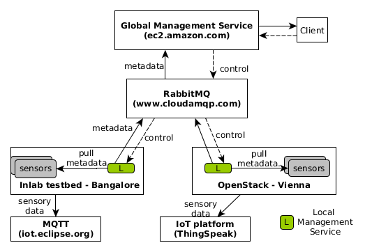

We setup a distributed testbed (see the figure below) for HINC. The testbed is spread over distributed sites: in Vienna, in Bangalore, in Hanoi and several public service (AmazonEC, CloudAMQP). This testbed and HINC will demonstrate the ability to manage distributed and large scale system and network. What we are going to setup is in the figure below:

{:width="500px"}

In this guideline, we just setup the IoT parts of the testbed. The network and cloud will be added later.

### Step 1: Setup a message queue broker on cloud

Before deploy HINC components and connect them, we need a communication middleware. In this tutorial, we register a free account on https://www.cloudamqp.com/ and create a Little Lemur plan (free), please follow the guideline on the website. 

After this step, you will get an **endpoint** to the message queue server which has been created.

(Some screenshots will be added)

### Step 2: Setup several IoT resources

Please follow [IoT resource tutorials](/iot-resources.html) to setup several sensors or providers as you wish. As in the first figure shown, we have some sensors running in Bangalore to send data to the MQTT and some sensors in Vienna to send data to the platform.

Note that, the sensors can be deployed on docker containers, on physical machines, or on virtual machines.

### Step 3: Configure and run HINC local

On each IoT resource site you have setup above, deploy a HINC Local Management Service for them. Firstly, you need to create a working folder and download the artifact:

```sh
$ mkdir /tmp/hinc-local
$ cd /tmp/hinc-local
$ wget https://github.com/SINCConcept/HINC/raw/artifacts/local-management-service-1.0.jar
``` 

HINC Local Management Service requires a configuration file to run, create a *hinc.conf* with the contents like below. Note that you need to edit the *BROKER* as per the CloudAMQP created before. The *GROUP* is customized to let a set of HINC components can communicate together.

```sh
$ nano hinc.conf
BROKER=amqp://<username>:<password>@bunny.cloudamqp.com/uluzkylq 
BROKER_TYPE=amqp 
GROUP=myGroup123
```

HINC Local Management Service requires a configuration file describe the resources to interface with. Depending on the IoT resource you created in last step, you need to download a particular plugin and create corresponding configuration file. For each case as followings:

**Emulated sensor**

```sh
$ wget https://github.com/SINCConcept/HINC/raw/artifacts/plugins/DummyProvider-1.0.jar
$ nano info-source.conf
{
    "source": [
        {
            "name": "teit-sensor",
            "type": "IoT",
            "interval": 0,
            "adaptorClass": "sinc.hinc.transformer.teit.TeitSensorAdaptor",
            "transformerClass": "sinc.hinc.transformer.teit.TeitSensorTransformer",
            "settings": {
                "workingDir": "/tmp/teit-sensor"
            }
        }
    ]
}
```


**Dummy provider**

```sh
$ wget https://github.com/SINCConcept/HINC/raw/artifacts/plugins/DummyProvider-1.0.jar
$ nano info-source.conf
{
    "source": [
        {
            "name": "Dummy",
            "type": "IoT",
            "interval": 0,
            "adaptorClass": "sinc.hinc.dummyprovider.plugin.DummyProviderAdaptor",
            "transformerClass": "sinc.hinc.dummyprovider.plugin.DummyProviderTransformer",
            "settings": {
                "endpoint": "http://localhost:8080/"
            }
        }
    ]
}

```


**OpenHAB**

```sh
$ wget https://github.com/SINCConcept/HINC/blob/artifacts/plugins/TransformOpenHAB-1.0.jar
$ nano info-source.conf
{
    "source": [
        {
            "name": "openHAB",
            "type": "IoT",
            "interval": 0,
            "adaptorClass": "sinc.hinc.transformer.openhab.OpenHABAdaptor",
            "transformerClass": "sinc.hinc.transformer.openhab.TranformOpenHABInfo",
            "settings": {
                "endpoint": "http://localhost:8080/rest"
            }
        }
    ]
}
```

Note that above configuration assumes that HINC Local Management is deployed on the same host with the resources (e.g. on the same gateway). 

Lately, the HINC Local Management Service can be run by command:

```sh
$ java -cp "*.jar" sinc.hinc.local.Main
```

HINC local will run and start listening the command from the HINC Global Management Service, which will be setup on the next step.

### Step 4: Run HINC Global Management Service and query information

You need to download the artifact of the HINC Global Management Service and put the same *hinc.conf* as above. In following commands, HINC Global run on the port 9000.

```sh
$ wget https://github.com/SINCConcept/HINC/raw/artifacts/global-management-service-1.0-war-exec.jar
$ nano hinc.conf
BROKER=amqp://<username>:<password>@bunny.cloudamqp.com/uluzkylq 
BROKER_TYPE=amqp 
GROUP=myGroup123
$ java -jar global-management-service-1.0-war-exec.jar -httpPort 9000
```
Note that the port is currently fixed. We will provide a user-defined port in the future.

Open the HINC Global via browser by point to the correct IP/Port to run this `http://localhost:9000/global-management-service-1.0`, we can have the list of APIs as bellow:

{:width="500px"}

The client can be used to query the information. Note that to replace *localhost* and *9000* with the correct IP and port of the HINC Global.

```sh
$ wget https://github.com/SINCConcept/HINC/raw/artifacts/client-gui-1.0.jar
$ java -jar client-gui-1.0.jar localhost 9000
```

{:width="600px"}
