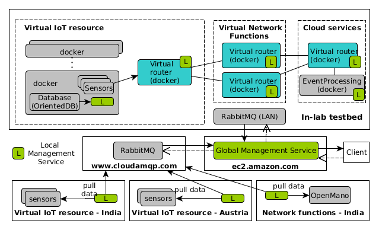

We setup a distributed testbed (see the figure below). The testbed is spread over distributed sites: in Vienna, in Bangalore, in Hanoi and several public service (AmazonEC, CloudAMQP). This testbed and HINC will demonstrate the ability to manage distributed and large scale system and network.

{:width="600px"}

Following steps, we can setup the testbed:

-- to be filled --
